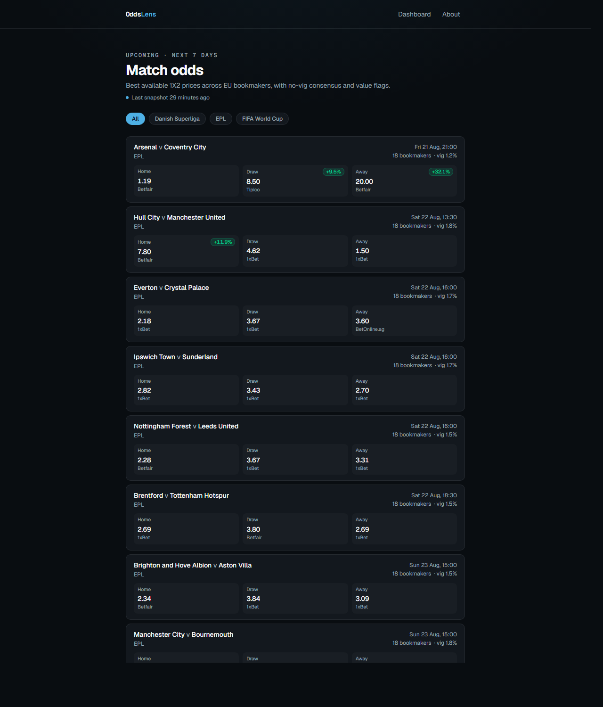
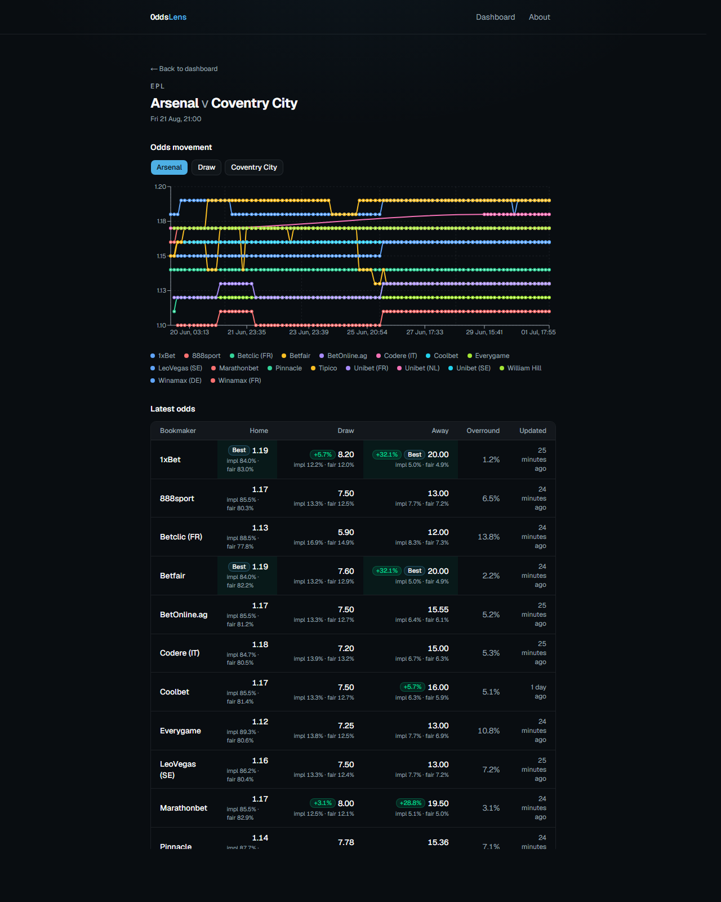
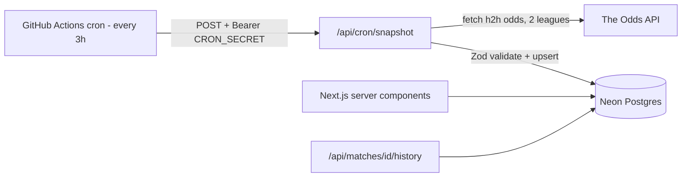

# OddsLens

[](https://github.com/souliN02/oddslens/actions/workflows/ci.yml)

**A football odds tracker that builds its own historical dataset** — snapshotting
bookmaker odds every 3 hours, computing no-vig consensus probabilities, and
flagging prices that beat the market.

**Live demo → https://oddslens-mocha.vercel.app** · **How it works → [/about](https://oddslens-mocha.vercel.app/about)**



Free odds APIs only give you the _current_ price; history is paywalled. OddsLens
manufactures its own history under a real constraint — **500 free API credits a
month** — which is the point of the project: a data pipeline sized around a hard
budget, not a CRUD demo.

## Features

- **Odds snapshots every 3 hours** into Postgres via a scheduled GitHub Actions job.
- **Dashboard** of upcoming matches with best available price per outcome, the
  offering bookmaker, lowest overround, and value badges.
- **Match detail** with a Recharts odds-movement chart (line per bookmaker,
  Home/Draw/Away toggle) and a per-bookmaker comparison table.

  

- **Value engine** — implied probability, overround (vig), no-vig fair
  probabilities, market consensus, and edge-vs-consensus flags, all
  [pure and unit-tested](src/lib/odds-math.ts).
- **`/about`** page explaining the pipeline and the maths with a live worked example.
- TypeScript strict throughout, Zod-validated API boundary, 100+ tests, green CI.

## Architecture



Pages read Postgres directly in React Server Components (no client fetching for
the initial render). The only mutating endpoint is the snapshot route, guarded
by a bearer secret. Raw API JSON is validated by Zod in a single boundary file so
the rest of the app never sees an untrusted shape.

## Stack

Next.js (App Router) · TypeScript strict · Tailwind CSS + shadcn/ui · Drizzle ORM
+ Neon Postgres · Zod · Recharts · Vitest + Testing Library · GitHub Actions +
Vercel.

## Local setup

Uses [pnpm](https://pnpm.io) (pinned via the `packageManager` field).

```bash
git clone https://github.com/souliN02/oddslens.git
cd oddslens
pnpm install
cp .env.example .env        # fill in DATABASE_URL (see below)

pnpm db:migrate            # apply Drizzle migrations to the DB
pnpm db:seed               # load tests/fixtures/odds-response.json into the DB
pnpm dev                   # http://localhost:3000
```

`pnpm db:seed` populates the UI entirely from the saved fixture — **development
and tests never call the live API** (the free tier is reserved for the scheduled
job). You only need a `DATABASE_URL`; `ODDS_API_KEY` and `CRON_SECRET` are only
required to run the live ingestion job.

### Run the tests

```bash
pnpm test         # vitest run — odds math, Zod boundary, snapshot route, dashboard render
pnpm typecheck    # tsc --noEmit
pnpm lint         # eslint
```

### Scripts

```bash
pnpm dev             # local dev server
pnpm build           # production build
pnpm lint            # eslint
pnpm typecheck       # tsc --noEmit
pnpm test            # vitest run
pnpm format          # prettier --write .
pnpm db:generate     # drizzle-kit generate migrations
pnpm db:migrate      # apply migrations
pnpm db:seed         # seed local/dev DB from the fixture
```

## Ingestion pipeline

- **`POST /api/cron/snapshot`** is the only mutating endpoint. It requires
  `Authorization: Bearer ${CRON_SECRET}`, fetches h2h odds for both leagues from
  [The Odds API](https://the-odds-api.com), validates them through the Zod
  boundary in [`src/lib/odds-api.ts`](src/lib/odds-api.ts), upserts via
  [`src/db/ingest.ts`](src/db/ingest.ts), logs `x-requests-remaining`, and
  returns `{ matches, snapshots, creditsRemaining }`. A unique
  `(match, bookmaker, captured_at)` index makes duplicate runs harmless.
- **[`.github/workflows/snapshot.yml`](.github/workflows/snapshot.yml)** curls
  that endpoint on a `0 */3 * * *` schedule (and on manual `workflow_dispatch`).

### Configuration

| Where  | Name           | Value                                                   |
| ------ | -------------- | ------------------------------------------------------- |
| Vercel | `DATABASE_URL` | Neon connection string                                  |
| Vercel | `ODDS_API_KEY` | the-odds-api.com key                                    |
| Vercel | `CRON_SECRET`  | long random string                                      |
| GitHub | `CRON_SECRET`  | secret — same value as Vercel                           |
| GitHub | `SNAPSHOT_URL` | variable — `https://<app>.vercel.app/api/cron/snapshot` |

After setting these, trigger `snapshot.yml` via **workflow_dispatch** to confirm
rows land in Neon and credits are logged in the Vercel function logs.

## Engineering decisions

- **Snapshots instead of a paywalled historical API.** The Odds API charges 10×
  for history. Recording the live `h2h` market for two leagues costs
  `regions × markets` = 2 credits/run; every 3 hours is 8 runs/day ≈ **480 of the
  free tier's 500 credits/month**, leaving ~20 for manual testing. The schedule is
  the single knob — every 4 hours drops it to ~360/month.
- **Zod at the boundary.** All external JSON is parsed and validated in
  [`src/lib/odds-api.ts`](src/lib/odds-api.ts) before touching the app, so a
  provider change (or a malformed payload) is contained to one file.
- **`numeric`, not float, for odds.** Prices are stored as Postgres `numeric` to
  avoid binary-float drift; Drizzle returns them as strings and they are converted
  to `number` in exactly one place ([`src/db/queries.ts`](src/db/queries.ts)),
  never inline.
- **Odds maths is pure and test-first.** Every calculation lives in
  [`src/lib/odds-math.ts`](src/lib/odds-math.ts) as a pure function with
  table-driven tests (implied, overround, no-vig, consensus, edge, best price),
  covering edge cases like fewer than three bookmakers and missing draw prices.
- **GitHub Actions as the scheduler, not Vercel Cron.** Vercel's Hobby plan caps
  cron at one run per day; the pipeline needs every 3 hours, so the schedule lives
  in GitHub Actions (a few minutes of drift is fine here).
- **Server components read the DB directly.** No client data fetching for the
  initial render; interactivity (chart toggles) is the only client-side code.

## Roadmap

Deliberately out of scope for the MVP (pick one next):

- Email alerts when an edge over _X_% appears
- Closing-line value: compare any snapshot against the final pre-kickoff price
- More markets (totals) or arbitrage detection across bookmakers
- A public, rate-limited JSON API

## Disclaimer

Educational analytics project. **Not betting advice.**
