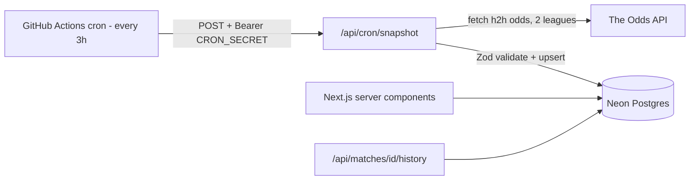

# LineDrift - Football Odds Tracker (MVP Spec)

A self-hosted football odds tracker that snapshots bookmaker odds over time, computes no-vig consensus probabilities, and flags outlier prices. Built as a production-grade portfolio project: deployed, tested, CI-backed, and designed around a real-world API budget.

> Renamed from the working title "OddsLens" (that name was taken); repo name: `linedrift`.

---

## 1. Portfolio narrative (why this project exists)

Free odds APIs only give you _current_ odds. Historical odds data is paywalled (The Odds API charges 10x credits for historical endpoints). So this app creates its own historical dataset: a scheduled job snapshots odds every 3 hours, stores them in Postgres, and the frontend turns that time-series into insight (odds movement charts, bookmaker margin analysis, value flags).

This is the story to tell in the README and in interviews: **a real data pipeline built under a real constraint (500 free API credits/month), not a CRUD demo.**

Disclaimer to include in the app footer and README: _"Educational analytics project. Not betting advice."_

---

## 2. MVP scope

**In scope (v1):**

- 2 leagues: English Premier League (`soccer_epl`) and Danish Superliga (`soccer_denmark_superliga`)
- 1 market: match winner / 1X2 (`h2h`), decimal odds, `eu` bookmaker region
- Scheduled snapshot ingestion every 3 hours via GitHub Actions
- Dashboard: upcoming matches with best available odds per outcome across bookmakers
- Match detail page: odds movement chart over time, per-bookmaker comparison table
- Value engine: implied probability, overround (vig), no-vig consensus, edge flags
- Unit tests for all odds math, CI pipeline, deployed live on Vercel

**Out of scope (v2 ideas, do NOT build now):**

- User accounts, alerts/notifications, more markets (totals, spreads), arbitrage detection, more leagues, mobile app

---

## 3. Tech stack (all free tier)

| Layer       | Choice                                   | Why (one line for the README)                                                                       |
| ----------- | ---------------------------------------- | --------------------------------------------------------------------------------------------------- |
| Framework   | Next.js (App Router) + TypeScript strict | Server components for DB reads, route handlers for ingestion; TS strict is the employability signal |
| Styling     | Tailwind CSS + shadcn/ui                 | Fast, consistent, looks professional without a designer                                             |
| Database    | Neon Postgres                            | Serverless Postgres, free tier, branchable                                                          |
| ORM         | Drizzle ORM + drizzle-kit migrations     | Type-safe schema, lightweight, SQL-first; migrations checked into git                               |
| Validation  | Zod                                      | Never trust external API data; validate at the boundary                                             |
| Charts      | Recharts                                 | Line charts for odds movement                                                                       |
| Testing     | Vitest + React Testing Library           | Fast unit tests; odds math is pure functions, ideal for table-driven tests                          |
| CI/CD       | GitHub Actions + Vercel                  | Lint + typecheck + test on every push; scheduled ingestion job                                      |
| Data source | The Odds API (free tier)                 | 500 credits/month, ~40 bookmakers incl. Bet365, clean JSON                                          |

Alternative considered (mention in README): OddsPapi has a free tier with more bookmakers, but The Odds API has the cleanest docs and stable free tier since 2020. Swapping providers later only touches `lib/odds-api.ts` thanks to the boundary layer.

---

## 4. API budget math (core constraint, put this in the README)

The Odds API free tier: **500 credits/month**, reset on the 1st. One `/odds` call costs `regions x markets` credits **per sport key**.

Our usage:

- 2 sport keys x 1 region (`eu`) x 1 market (`h2h`) = **2 credits per snapshot run**
- Every 3 hours = 8 runs/day = **16 credits/day = ~480/month** -> fits with ~20 credits spare for manual testing

Rules that follow from this:

1. The snapshot endpoint logs `x-requests-remaining` and `x-requests-used` response headers on every run.
2. **Development never calls the live API.** A real response is saved once as a fixture (`tests/fixtures/odds-response.json`) and used for all local dev and tests.
3. If credits run low, the GitHub Actions schedule is the only knob to turn (e.g. every 4 hours = 360/month).

---

## 5. Architecture



- Pages read the DB directly via server components (no client fetching for initial render).
- The only mutating endpoint is the snapshot route, protected by a bearer secret.
- The Odds API client lives in one file (`src/lib/odds-api.ts`) with a Zod schema, so the rest of the app never sees raw external JSON.

---

## 6. Data model (Drizzle schema)

```
leagues
  key          text PK            -- e.g. 'soccer_epl'
  title        text               -- 'Premier League'

bookmakers
  key          text PK            -- e.g. 'bet365'
  title        text

matches
  id           uuid PK default random
  external_id  text UNIQUE        -- id from The Odds API
  league_key   text FK -> leagues.key
  home_team    text
  away_team    text
  commence_time timestamptz       -- index this

odds_snapshots
  id           bigserial PK
  match_id     uuid FK -> matches.id
  bookmaker_key text FK -> bookmakers.key
  home_odds    numeric(7,3)
  draw_odds    numeric(7,3)
  away_odds    numeric(7,3)
  captured_at  timestamptz
  -- index (match_id, captured_at)
  -- unique (match_id, bookmaker_key, captured_at)
```

Notes:

- Odds are stored as `numeric`, never float. Convert to number only at the display/math layer.
- Ingestion upserts leagues/bookmakers/matches, then inserts one snapshot row per (match, bookmaker).
- A seed script (`db/seed.ts`) loads the fixture file so the UI is fully populated in local dev.

---

## 7. Odds math (the differentiator)

All functions live in `src/lib/odds-math.ts` as **pure functions**. This module gets the most thorough unit tests in the project (table-driven, edge cases included). Definitions:

- **Implied probability:** `implied = 1 / decimalOdds`
- **Overround (bookmaker margin / vig):** `overround = impliedHome + impliedDraw + impliedAway - 1` (typically 2-8%; display as a percentage per bookmaker)
- **No-vig (fair) probabilities:** each implied probability divided by the sum, so they total 1
- **Consensus fair probability:** mean of the no-vig probabilities across all bookmakers with a current snapshot for that match. Require at least 3 bookmakers, otherwise no consensus and no flags.
- **Edge:** for a given bookmaker price and outcome: `edge = decimalOdds x consensusFairProb - 1`. Flag as "value" when `edge >= 0.03` (3%, configurable constant). Show edge as a percentage badge.
- **Best price:** highest decimal odds per outcome across bookmakers in the latest snapshot set.

Edge cases the tests must cover: fewer than 3 bookmakers, odds of exactly 1.0 or missing draw price, a bookmaker missing from one snapshot run, division guards.

---

## 8. Pages and UI

**`/` Dashboard**

- Upcoming matches (next 7 days), grouped or filterable by league
- Per match: kickoff time (Europe/Copenhagen), best odds per outcome with the bookmaker name, lowest overround, value badges where edge >= 3%
- "Last snapshot: X minutes ago" indicator
- States: loading skeletons, empty state ("First snapshot pending - the cron runs every 3 hours"), error boundary

**`/match/[id]` Detail**

- Line chart (Recharts): decimal odds over time, one line per bookmaker, toggle between Home/Draw/Away
- Table: latest odds per bookmaker with implied prob, no-vig prob, overround, edge vs consensus
- Best price per outcome highlighted

**`/about`**

- Plain-language explanation of the pipeline and the math (this page is for recruiters and reviewers)
- The architecture diagram and the budget math from this spec
- The educational disclaimer

Design: dark theme, responsive (tables collapse to cards on mobile), consistent shadcn/ui components. No login, everything public and read-only.

---

## 9. Internal API

- `POST /api/cron/snapshot` - requires `Authorization: Bearer ${CRON_SECRET}`. Fetches both leagues, validates with Zod, upserts entities, inserts snapshots. Returns JSON `{ matches, snapshots, creditsRemaining }`. Must be safe to retry (unique constraint on snapshots makes duplicate runs harmless).
- `GET /api/matches/[id]/history` - returns chart-ready series for the detail page.

Everything else reads the DB in server components.

---

## 10. Testing and CI

**Tests (Vitest):**

- `odds-math.test.ts` - the bulk of coverage, table-driven cases per function
- `odds-api.test.ts` - Zod schema parses the real fixture; transform maps API JSON to DB rows; rejects malformed payloads
- `snapshot-route.test.ts` - rejects missing/wrong bearer token (401), happy path with mocked fetch
- One render test for the dashboard with seeded fixture data

**Workflows (`.github/workflows/`):**

- `ci.yml` - on push + PR: install, lint, typecheck, test, build
- `snapshot.yml` - `schedule: cron '0 */3 * * *'` + manual `workflow_dispatch`; curls the deployed snapshot endpoint with the secret. Note in README: GitHub schedules can drift a few minutes, which is fine here.

**Workflow discipline (even solo):** feature branch per phase, PR into main, CI must be green before merge. This produces a GitHub history that looks like a professional, not a student.

---

## 11. Environment variables

```
DATABASE_URL=        # Neon connection string
ODDS_API_KEY=        # the-odds-api.com
CRON_SECRET=         # long random string, also stored as GitHub Actions secret
```

Commit a `.env.example` with these keys and no values. Never commit `.env`.

---

## 12. Build phases (one Claude Code session each)

Work through these in order. Each phase = one feature branch, one PR, one merge. Kickoff prompt for every phase: _"Read SPEC.md and CLAUDE.md. Plan Phase N first and show me the plan before writing code."_

**Phase 0 - Skeleton and deploy**
Next.js + TS strict + Tailwind + shadcn/ui + ESLint/Prettier. Vitest configured with one passing dummy test. `ci.yml` running lint/typecheck/test/build. Deploy the empty shell to Vercel.
_Done when: live URL exists and CI is green._

**Phase 1 - Data layer**
Drizzle schema from section 6, migrations generated and committed, Neon connected, `db/seed.ts` loading fixture data, simple server-component page listing seeded matches to prove the pipe works.
_Done when: `npm run db:seed` populates Neon and matches render on a page._

**Phase 2 - Ingestion**
`lib/odds-api.ts` (typed client + Zod schema), save one real API response as the fixture, `POST /api/cron/snapshot` with bearer auth + upsert logic + credit logging, `snapshot.yml` workflow, secrets configured in Vercel and GitHub.
_Done when: manual `workflow_dispatch` run inserts real snapshots into Neon and logs credits remaining._

**Phase 3 - Dashboard**
The `/` page from section 8 with real data, all loading/empty/error states, league filter, responsive layout.
_Done when: dashboard renders live data and looks presentable on mobile._

**Phase 4 - Match detail**
`/match/[id]` with the Recharts movement chart, outcome toggle, and bookmaker table. History endpoint.
_Done when: a match with 5+ snapshots shows a meaningful multi-line chart._

**Phase 5 - Value engine**
`lib/odds-math.ts` with full test suite written first (TDD this phase), then wire edge badges, overround, and best-price highlighting into both pages.
_Done when: all math tests pass and value badges appear for real outliers._

**Phase 6 - Polish and presentation**
`/about` page, README per section 13, OG image, repo description + topics, MIT license, screenshots/GIF, Lighthouse pass.
_Done when: you would send this link to a hiring manager._

---

## 13. README checklist (this is what reviewers actually read)

- One-line pitch + live demo link at the very top + CI badge
- Screenshot or short GIF of the dashboard
- Features list (short)
- Architecture diagram (mermaid, from section 5)
- **"Engineering decisions" section** - the budget math, why snapshots instead of a historical API, why Zod at the boundary, why numeric not float for odds, why GitHub Actions as scheduler instead of Vercel cron (Hobby plan cron is limited to daily runs)
- Local setup (clone, env, `db:migrate`, `db:seed`, `dev`) and how to run tests
- Roadmap (the v2 list from section 2)
- Educational disclaimer

---

## 14. v2 ideas (after the MVP ships, pick ONE)

- Email alerts when an edge over X% appears (Resend free tier)
- Closing line value: compare any snapshot against the final pre-kickoff odds
- More markets (totals) or arbitrage detection across bookmakers
- Public JSON API with rate limiting (Upstash) - turns the project into a service
